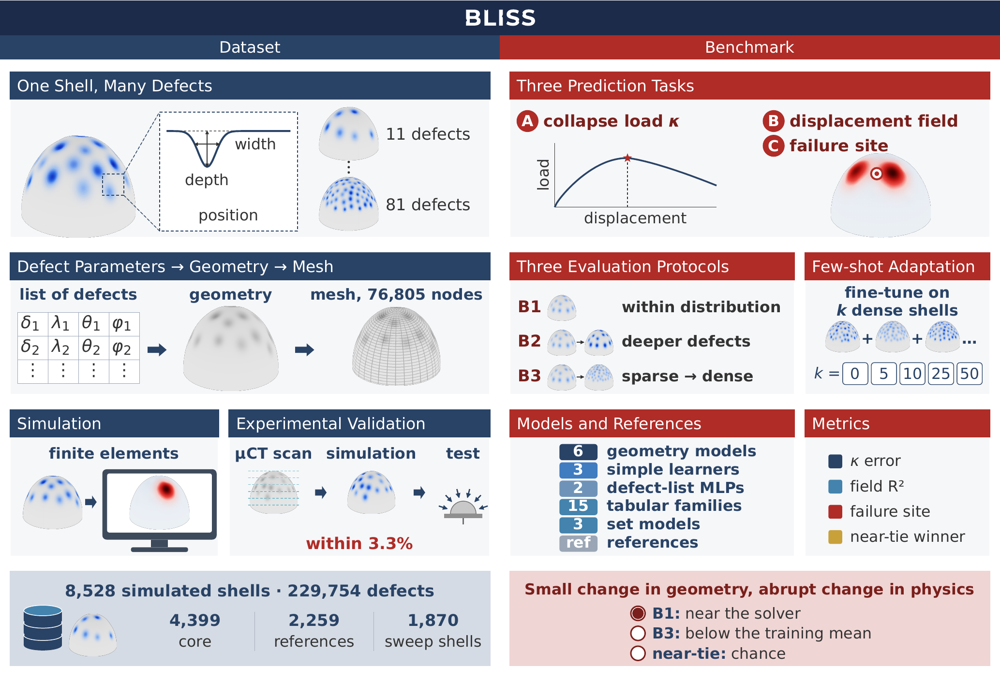

<p align="center">
  
</p>

# BLISS: a dataset and benchmark for the buckling of imperfect spherical shells

<p align="center">
  
  
  
</p>

<p align="center"><strong>A small change in the geometry of a thin shell can move its collapse to another place.
BLISS measures whether a surrogate model sees it.</strong></p>

## Summary

**BLISS** is a dataset and benchmark for surrogate models of shell buckling. Each shell is a clamped hemisphere
under external pressure, with 11 to 81 small inward defects on its surface. A model reads the surface deviation
`w` at the nodes of one shared mesh and predicts three things:

- the **knockdown factor** `kappa`, the collapse pressure over the classical pressure of the perfect sphere;
- the **displacement field** at the peak load;
- the **failure site**, where the shell collapses, read from the predicted field.

The dataset holds 8,528 simulated shells: 4,399 core shells with fields, 1,870 edited shells for the
intervention tests, and 2,259 single- and two-defect shells as tabulated rows. During review a sample of the
dataset is available through an anonymized link:
[https://osf.io/vyr3c/?view_only=4c5fd2f7aae1440e8de3e0bebece4648](https://osf.io/vyr3c/?view_only=4c5fd2f7aae1440e8de3e0bebece4648),
and the full dataset is available to reviewers on request.

This repository contains the code that produced every result of the paper: the `bliss` package (loader and
scorer), the benchmark pipelines (data preparation, eight field models with one training recipe, hyperparameter
search, tabular and set models on the list of defects, reference baselines, intervention tests, few-shot study,
results tables).

<p align="center">
  
</p>

## Statement of need

Surrogate models of physical systems are usually tested on random splits, new initial conditions or held-out
ranges of sampled inputs. In BLISS an instability creates the distribution shift: two defects moving close enough
to interact change how the shell collapses. Within distribution, as on existing benchmarks, the best models reach a
field R² of 0.985 and find 98% of clear failure sites. Trained on shells with far-apart defects and tested on
shells with close defects, every model that reads the shell geometry scores below a constant prediction of the
average training shell on the field. Moving a single pair of defects from 25° to 10° apart lowers the collapse
load by 14% in the solver, while the models predict almost no change. BLISS gives one fixed task, three
protocols and one scorer, so that two papers reporting a BLISS number report the same number.

| protocol | train / val / test | what changes |
|---|---|---|
| **B1** within distribution | 3,299 / 440 / 660 | nothing (random split, seed 2027) |
| **B2** deeper defects | 2,789 / 376 / 1,234 | test shells have their deepest defect above 2.35 t |
| **B3** sparse to dense | 1,934 / 265 / 2,200 | train on sparse shells, test on dense shells, where defects interact |

Headline metrics: median relative error of `kappa`, buckling R² (field R² after removing the uniform
contraction), clear-site accuracy (failure site within 10° on shells with one clear winner, q < 0.7) and the
near-tie winner rate (shells where two sites compete, q > 0.9). All are computed by `bliss.metrics`.

## Authorship

Authors and affiliations are withheld for double-blind review and will be added at publication.

## Getting started

### What's in this repo

```
bliss/                     the Python package
    __init__.py            loader of the release: shells, splits, parametric tables
    metrics.py             the scorer: every metric of the paper, shell bootstrap, paired comparisons
    geometry.py            frame of the hemisphere, grid resampling, first limit point
benchmark/                 the pipelines of the paper, one folder per stage (below)
    data/                  training arrays and the table of defects
    field_models/          the eight field models: training, search, confirmation, transfer to B2/B3
    parametric/            the models that read the list of defects
    references/            the references: shape baselines, site baselines, solver increments
    analyses/              intervention tests P1-P4 and few-shot adaptation on B3
    tables/                rescoring of every prediction and the tables of the paper
configs/                   frozen hyperparameters of the eight field models (winners of the search on B1)
splits/                    B1.json, B2.json, B3.json: the three protocols of release 1.0 (ids of the 4,399 core shells)
tests/                     tests of the scorer (pytest)
docs/                      logo and overview figure
pyproject.toml, Makefile, requirements*.txt, constraints.txt, environment.yml, LICENSE
```

### Scripts

Each folder under [`benchmark/`](./benchmark) is a stage of the paper. Run every command from the root of the
repository.

- [`benchmark/data/`](./benchmark/data): `download.py` fetches the review sample into `BLISS-1.0/` from its
  anonymized link, with a checksum check, and creates the links the scripts read; `prepare_data.py` builds the
  8,192-node training arrays and the 180 x 720 grid of every shell; `prepare_parametric.py` builds one table of
  every shell and its defects, for the models on the list of defects.
- [`benchmark/field_models/`](./benchmark/field_models): `train.py` trains and evaluates the eight field models
  with one recipe (also inference), the six geometry models that read `w` and the two MLPs on the list of defects; `search_space.py` and `search.py` run the hyperparameter search on B1 (Optuna,
  TPE, 60-epoch trials); `confirm.py` trains the best configurations 200 epochs x 3 seeds, picks the winner and
  opens the B1 test set; `transfer.py` trains the frozen winner on B2 and B3 (and at other input resolutions).
- [`benchmark/parametric/`](./benchmark/parametric): the models that read the list of defects, 15 tabular model
  families (`defect_features.py`, `tabular_models.py`, `tabular.py`), flat, DeepSets and pairwise set models
  (`set_models.py`, `set_train.py`), and the weakest-link rule fitted on the single-defect shells
  (`weakest_link.py`).
- [`benchmark/references/`](./benchmark/references): training mean, kNN, PCA-ridge, gradient boosting and weakest
  link on `w` (`shape_baselines.py`); deepest point, random site and random defect (`site_baselines.py`); the
  solver's neighbouring increments (`solver_increments.py`).
- [`benchmark/analyses/`](./benchmark/analyses): the intervention tests P1-P4 (`interventions_inputs.py`,
  `interventions_predict.py`, `interventions_score.py`) and few-shot adaptation on B3 (`fewshot.py`).
- [`benchmark/tables/`](./benchmark/tables): `rescore.py` rescores every stored prediction with the scorer;
  `main_table.py` and `full_tables.py` write the tables of the paper.

### Install

Python 3.11 and an NVIDIA GPU with a CUDA 12.8-compatible driver. PyTorch, torch-harmonics (SFNO) and NVIDIA
PhysicsNeMo (FigConvNet) must be installed in this order, and torch-harmonics is compiled against the installed
PyTorch, which needs a C++ compiler and the CUDA toolkit (`nvcc`) on the path.

```bash
# download this anonymized repository and enter it
conda env create -f environment.yml
conda activate bliss
make install
make test
```

`make install` runs, in order:

```bash
pip install torch==2.9.1 torchvision==0.24.1 --index-url https://download.pytorch.org/whl/cu128
pip install --no-build-isolation --no-deps --no-binary torch-harmonics torch-harmonics==0.8.0
pip install --no-deps nvidia-physicsnemo==2.2.2
pip install -r requirements-physicsnemo.txt -c constraints.txt
pip install torch_scatter==2.1.2 -f https://data.pyg.org/whl/torch-2.9.0+cu128.html
pip install -r requirements.txt -c constraints.txt
pip install -e . -c constraints.txt
```

`constraints.txt` keeps PyTorch at 2.9.1, the version the models of the paper were trained with. PhysicsNeMo 2.2.2
declares `torch>=2.10` but runs on 2.9.1, so it is installed without its dependencies, which
`requirements-physicsnemo.txt` then installs with PyTorch kept fixed. FigConvNet also needs `torch_scatter`,
installed from the prebuilt wheels of PyTorch Geometric for PyTorch 2.9 and CUDA 12.8.
Only the loader and the scorer are needed to evaluate predictions; for those, `pip install -e .` is enough.

### Dataset

The release is documented in the paper and in its datasheet; the review sample ships with its own README. Every
record is on one shared mesh of 76,805 nodes, so shells are compared node by node.

```
BLISS-1.0/
├── shared.npz              P (76,805 x 3 unit node directions), conn (S4R elements), R,
│                           and the map to the 180 x 720 grid (grid_beta, grid_theta, knn_idx, knn_w)
├── canonical/<id>.npz      one record per core shell: w (input), kappa and U_peak (targets), U_prev, U_next,
│                           mode, the load path lpf with peak_frame, q, r_d2_d1, implied_gap_pct
├── sweeps/                 the records of the intervention tests P1-P4, same keys, with the id of their source
├── metadata/               shells.csv and defect_parameters.csv (depth, width, theta, phi of every defect),
│                           truth_dominance.csv (site ratio q and the two competing sites),
│                           single_defect_kd.csv and the single- and two-defect shells
├── splits/                 B1.json, B2.json, B3.json: the three protocols, fixed with seed 2027
└── README.md               the card of the release
```

### Download (review sample)

One command downloads the review sample from its anonymized link, checks its SHA-256, unpacks it into
`BLISS-1.0/` and creates the links the scripts read (`splits/v2/`, `metadata/`, `release`, `outputs/`):

```bash
python benchmark/data/download.py

# read one shell from Python
python -c "import bliss; d = bliss.load('BLISS-1.0'); s = d[d.split('B1')[2][0]]; print(s.id, s.w.shape, s.U.shape, s.kappa)"
```

(Manual alternative: download `BLISS.zip` from
[https://osf.io/vyr3c/?view_only=4c5fd2f7aae1440e8de3e0bebece4648](https://osf.io/vyr3c/?view_only=4c5fd2f7aae1440e8de3e0bebece4648),
unzip it, `mv BLISS BLISS-1.0`, and run `python benchmark/data/download.py --links-only`.) With the full
release in `BLISS-1.0/`, run the same `--links-only` command. The scorer reads the release from `BLISS-1.0/`
at the root of this repository; set `BLISS_RELEASE` if it is elsewhere.

### Quick start: load a shell and score a prediction

```python
import bliss
from bliss.metrics import score_ci

d = bliss.load("BLISS-1.0")
train, val, test = d.split("B1")                # also "B2", "B3"
s = d[test[0]]
print(s.w.shape, s.U.shape, s.kappa, s.q)       # input, field target, scalar target, site ratio
print(s.defects[:3])                            # depth, width, theta, phi of each defect

m = score_ci("outputs/figconv_v2random_test_pred.npz", n_boot=2000)["metrics"]
print(m["kappa_rel_err"], m["buckling_r2"])     # point value and 95% shell-bootstrap interval
```

A prediction file holds `ids`, `pred_U` (shells x 8,192 x 3, mm) and `pred_K`, and the ground truth `true_U`,
`true_K` and `P`; `train.py` writes this format. `bliss.metrics.score_submission(file, "B1")` scores a file
that holds only the predictions, reading the truth from the full release.

Train one model on the review sample and score it (one epoch, a few minutes on one GPU):

```bash
python benchmark/data/prepare_data.py            # grid of every shell
python benchmark/data/prepare_data.py canon      # training arrays on the 8,192 nodes
python benchmark/field_models/train.py figconv v2/random --epochs 1
```

### Hardware & runtime

| resource | paper setting | notes |
|---|---|---|
| GPU | NVIDIA H100 and A100 (most runs), one run per GPU | 1,967 GPU-hours of training for the whole benchmark |
| field model, B1 final | about 7 GPU-hours per 200-epoch run | 272 GPU-hours over 39 runs |
| hyperparameter search | 217 trials of 60 epochs | 876 GPU-hours |
| tabular models | CPU | 2,887 core-hours of searches and finals |

### What lands in `outputs/`

```
outputs/
├── canon_nodes_8192.npz, canon_grid.npz     training arrays on the 8,192 nodes and on the grid (prepare_data.py)
├── parametric_master.parquet                every shell and its defects (prepare_parametric.py)
├── <tag>_ckpt.pt, <tag>_best_ema.pt         last checkpoint and the EMA weights with the best validation buckling R2
├── <tag>_val_pred.npz, <tag>_test_pred.npz  predictions in the scorer's format
├── curves.jsonl                             validation metrics per epoch of every run
├── results.jsonl                            one line per finished run: test metrics, settings, hardware
└── rescore_v2.json                          every prediction rescored with the scorer (rescore.py)
```

`<tag>` is `<model>_<split>` with the split's slash removed, plus `_s<seed>` for seeds other than 0, e.g.
`figconv_v2random_s1`.

### Reproduce the results

Run every command from the repository root, after the download step above. The examples use FigConvNet; replace `figconv` by `transformer`,
`transolver`, `mgn`, `deeponet`, `sfno`, `mlp` or `mlp80`.

**1. Prepare the data**

```bash
python benchmark/data/prepare_data.py            # grid of every shell (SFNO)
python benchmark/data/prepare_data.py canon      # outputs/canon_nodes_8192.npz and canon_grid.npz
python benchmark/data/prepare_parametric.py      # outputs/parametric_master.parquet
```

**2. Train on B1 with the frozen configuration** (seeds 0, 1, 2)

```bash
CFG=configs/phase2_figconv_v2random_n8192_buckling_hp2.json
ARGS=$(python -c "import json,sys; sys.path.insert(0,'benchmark/field_models'); import search_space as S; print(' '.join(S.as_args('figconv', json.load(open('$CFG'))['winner_params'])))")
python benchmark/field_models/train.py figconv v2/random --epochs 200 --seed 0 $ARGS
```

The trainer keeps the EMA weights with the best validation buckling R², scores the test set once with them, and
writes `outputs/<tag>_test_pred.npz` and one line of `outputs/results.jsonl`.

**3. Train on B2 and B3 with the same frozen configuration**

```bash
for s in 0 1 2; do NODES=8192 python benchmark/field_models/transfer.py --model figconv --phase B2 --study-suffix _hp2 --only $s; done
NODES=8192 python benchmark/field_models/transfer.py --model figconv --phase B2 --study-suffix _hp2 --confirm
```

(`--phase B3` for B3. `NODES=8192` selects the 8,192-node configuration used in the paper.)

**4. Inference.** Run the training command again. When the checkpoint in `outputs/` has reached its last epoch,
the trainer trains nothing: it loads the selected EMA weights and writes the test predictions again.
`--dump-val` and `--dump-train` also write the validation and training predictions.

**5. Hyperparameter search** (optional; the winners are in `configs/`)

```bash
python benchmark/field_models/search.py --model figconv --split v2/random --nodes 8192 --study-suffix _hp2     # one worker per GPU
python benchmark/field_models/confirm.py --model figconv --split v2/random --nodes 8192 --study-suffix _hp2 --freeze
python benchmark/field_models/confirm.py --model figconv --split v2/random --nodes 8192 --study-suffix _hp2 --only 0   # units 0..8
python benchmark/field_models/confirm.py --model figconv --split v2/random --nodes 8192 --study-suffix _hp2 --confirm
```

**6. Models on the list of defects**

```bash
python benchmark/parametric/tabular.py hpo --split B1 --rep topk
python benchmark/parametric/tabular.py final --split B1 --rep topk
python benchmark/parametric/weakest_link.py
python benchmark/parametric/set_train.py hpo --arch pairwise --split B1 --target residual
python benchmark/parametric/set_train.py final --arch pairwise --split B1 --target residual
```

**7. References, intervention tests and few-shot**

```bash
python benchmark/references/shape_baselines.py
python benchmark/references/site_baselines.py
python benchmark/references/solver_increments.py
python benchmark/analyses/interventions_inputs.py
python benchmark/analyses/interventions_predict.py build
python benchmark/analyses/interventions_predict.py infer --families figconv,sfno,transformer --seeds 0,1,2
python benchmark/analyses/interventions_score.py
python benchmark/analyses/fewshot.py --stage all --models figconv,sfno,transformer
```

**8. Tables of the paper**

```bash
python benchmark/tables/rescore.py
python benchmark/tables/main_table.py
python benchmark/tables/full_tables.py
```

### What the review sample supports

The sample on OSF holds 55 core shells, the intervention test P3 for five sources, and 25 single- and 25
two-defect shells, in the format of the full release (records on the 76,805-node mesh and the shared mesh). On it
run end to end: the data preparation (step 1), the training of every field model, the search, `confirm.py` and
`transfer.py` (steps 2, 3 and 5), the tabular and set models and the weakest-link rule (step 6), the shape and solver
references (step 7), `rescore.py` and the scorer (`score_ci`, `score_submission`). Its splits hold a few dozen shells,
so it does not reproduce the numbers of the paper.

Three parts need the full release, which is available to reviewers on request: the few-shot study and the site
references need more dense test shells than the sample holds, the intervention tests read the sweep tables of P1 to P4,
and `main_table.py` and `full_tables.py` read the rescored predictions of every model.

## Community support

Questions and bug reports will be handled through the issue tracker of the public repository after review.

## License

Code: MIT (`LICENSE`). Data: CC BY 4.0.
